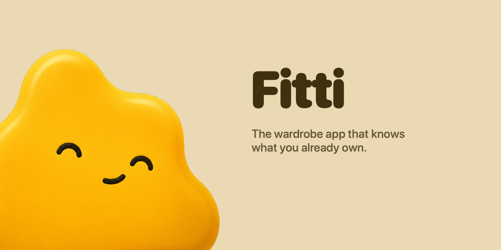

# Fitti

Your closet, but it knows what's in it.

Photograph your wardrobe and Fitti catalogs every garment — cut out, tagged, and
searchable. It builds outfits from what you already own, and when you go looking
for something new, the feed is filtered through your real closet and your real taste.

Native iOS app, with a web companion.

---

## Why this exists

Every wardrobe app dies the same way: adding clothes is unbearable. Users report
spending **5–15 minutes per item** in the incumbents. A 100-piece closet is a
full weekend of data entry, so nobody finishes, and the app gets deleted at item 20.

Fitti's single design constraint is therefore **the fewest possible taps to save a
garment**:

- **Rapid-fire camera** — snap, snap, snap. No forms. Ever. The item card appears
  the instant the shutter fires; tagging happens later, invisibly.
- **Share sheet** — see clothes in Instagram or TikTok, share to Fitti, done.
  You never open the app.
- **Bulk import** — 50 photos from your library at once.
- **One photo, many garments** — shoot the whole closet; it finds the pieces.
- **Forward a receipt** — forward an order confirmation and the items arrive with
  brand, size, price, and the retailer's own product photo already attached.

Nothing in Fitti has a required text field.

---

## How it works

Garment cutouts happen **on your phone**, using Apple's Vision framework — free,
offline, and instant. Nothing about a photo of your bedroom needs to leave the
device to become a floating jacket on a colored background.

What does go to the server is a cutout with its location metadata already stripped,
into a private bucket that the database itself refuses to hand to anyone else.

Tagging uses a vision model with a forced schema; colors are computed
deterministically in CIELAB rather than guessed at, so "navy" means the same thing
every time. Everything is embedded into a vector index so the app can answer
"what else looks like this" and "what goes with this".

---

## Layout

```
fitti/
├── ios/         SwiftUI app — capture, cutout, closet, discovery
├── web/         Next.js 16 — landing, auth, read-only closet
├── worker/      Cloudflare Worker — image delivery + ingest queue
├── supabase/    Postgres schema, RLS policies, migrations
├── assets/      Logo and mascot source
└── docs/        Design system, data model, decisions
```

## Research

- **[docs/ANIMATION.md](docs/ANIMATION.md)** — why the mascot is a Metal shader and
  not a sprite sheet or a transparent video, what each shader does, and why Rive
  was taken back out.
- **[docs/DECISIONS.md](docs/DECISIONS.md)** — why the stack is what it is, with
  the numbers that settled each call.
- **[docs/DESIGN.md](docs/DESIGN.md)** — the colour system: one butter ground, the
  twelve hues demoted to a personal accent, and the jelly every form is made of.
- **[docs/STAGES.md](docs/STAGES.md)** — build progress.
- **[docs/RUNNING.md](docs/RUNNING.md)** — how to run it.

App Store submission is covered by the `ios-app-store-readiness` skill, with the
automatable half in `scripts/pre-submit.sh`.

## Status

Runs on iOS. Building in stages.
